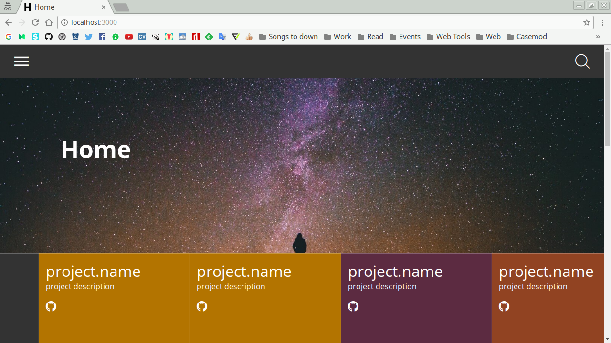

## Dragon Theme


This is a simple and cool theme for Jekyll, made for developers that want to write blog posts but don't want create a theme from scratch.

Features:

- Jekyll
- Gulp
- Sass/Scss
- Font icons
- Small (39.3kb of CSS and 8.8kb of JS initially)
- Offcanvas menu
- Live search
- Categories page
- About page
- Series page
- Tags page
- Feed RSS
- Info and colors are easy to customize!
- Sitemap.xml



## Getting Started

1. [Install Jekyll](http://jekyllrb.com)
1. Clone or fork the [Dragon 
Theme](https://github.com/onhernandes/dragon-theme)
1. Edit `_config.yml` to personalize your site.
1. Check out the sample post in `_posts` to see examples for assigning all of the data.
1. Read the documentation below for customization.
1. **Compile your assets files with Gulp.**

## Settings

You have to set some infos on `_config.yml` to customize your site/blog.

```
# Site settings
baseurl: "" # the subpath of your site, e.g. /blog/ or empty.
url: "http://localhost:3000" # the base hostname & protocol for your site 
title: The title of your blog
description: A tiny and cool description
email: your@email.com
user_description: Anon Developer at Lorem Ipsum Dolor
email: anon@anon.com
facebook: your_username
instagram: your_username
twitter: your_username
github: your_username
spotify: your_username
```

## Theme SCSS and more

The SCSS is in 
[dev/scss](https://github.com/onhernandes/dragon-theme/tree/master/dev/scss) 
and the basic styles are in 
[dev/scss/pages/template](https://github.com/onhernandes/dragon-theme/tree/master/dev/scss/pages/template), 
the rest of theme is separated in folders, also inside of 
[dev/scss/pages](https://github.com/onhernandes/dragon-theme/tree/master/dev/scss/pages).

Each page(or kind of) has his own folder inside of 
[dev/scss/pages](https://github.com/onhernandes/dragon-theme/tree/master/dev/scss/pages) 
and then are component-separated. So if you want to change page' styles, you know where find the files.

The 
[partials](https://github.com/onhernandes/dragon-theme/tree/master/dev/scss/partials) 
folder has partials files like `_base.scss` and `_colors.scss`.

If you want to create post series, use the `series` on _config.yml, the same for creating projects and menu links.

## Running blog locally

In order to run Jekyll on local you need to:

- Install [NodeJS](https://nodejs.org/)
- Run `sudo npm install -g gulp`
- Run `sudo npm install --save-dev`
- Run `sudo gulp`

## Issues

If you're having problems with this theme and they aren't made by you, open and [issue](https://github.com/mhernandes/dragon-theme/issues)

## License

This theme is totally free, so anyone can just clone this and change whatever without worry about copyright or things like that.
